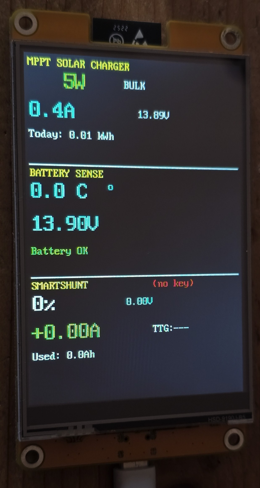

# Victron Solar Display ESP32

> 🙏 **Fork of [wytr/VictronSolarDisplayEsp](https://github.com/wytr/VictronSolarDisplayEsp/tree/dev)**  
> Original project by [@wytr](https://github.com/wytr) for ESP32-S3 + LVGL.  
> This version has been simplified and ported to standard ESP32 (Freenove FNK0103S) with direct display driver.
>
> ⚠️ **Note:** AES decryption keys are hardcoded in the source for simplicity.  
> Not elegant, but damn convenient! 😎

### Why this fork?

I didn't have the hardware required by the original project, and honestly, I didn't need fancy graphics either 🙂 So I decided to create a version for the hardware I had on hand, tailored to my specific needs for monitoring the solar system in my camper van.

---

Compact display for real-time monitoring of Victron Energy devices via Bluetooth Low Energy (BLE).



## 📋 Overview

This project implements a standalone display to show real-time data from Victron Energy devices:

- **SmartSolar MPPT** - Solar charge controller
- **SmartBatterySense** - Battery voltage and temperature sensor  
- **SmartShunt** - Full battery monitor
- **Blue Smart IP22 Charger** - AC battery charger (12V/15A)

### Features

- ✅ Direct ST7796 display via SPI (no LVGL)
- ✅ Continuous passive BLE scanning
- ✅ AES-CTR decryption of Victron data
- ✅ **MAC-based device identification** (reliable key selection)
- ✅ Hardcoded AES keys (no WiFi/captive portal)
- ✅ **4-quadrant landscape layout** (480x320)
- ✅ **LED-style segmented progress bars** (20 segments with gaps)
- ✅ **Intelligent caching** (flicker-free updates)
- ✅ Updates every second
- ✅ Reduced memory footprint (~200KB app)

## 🔧 Supported Hardware

### Target Display
- **Freenove ESP32 Display** (FNK0103S)
- MCU: ESP32-WROOM-32E
- Display: 4.0" ST7796S 320x480 SPI
- Touch: XPT2046 (not used)
- Flash: 4MB (no PSRAM)

### Display Pinout

| Function | GPIO |
|----------|------|
| MOSI | 13 |
| MISO | 12 |
| SCLK | 14 |
| CS (LCD) | 15 |
| DC | 2 |
| Backlight | 27 |
| RST | - (not connected) |

## 📡 Supported Victron Devices

### 1. SmartSolar MPPT (Record Type 0x01)

Solar charge controllers from the SmartSolar series.

**Displayed data:**
- PV Power (W) - main value
- Charge current (A)
- Battery voltage (V)
- State (OFF/BULK/ABSORB/FLOAT/etc.)
- Daily yield (kWh)

### 2. SmartBatterySense (Record Type 0x02, PID 0xA3A4/0xA3A5)

Wireless battery voltage and temperature sensor.

**Displayed data:**
- Battery temperature (°C) - main value
- Battery voltage (V)

⚠️ **Note:** SmartBatterySense uses the same record type as Battery Monitor (0x02) but only transmits voltage and temperature. Other fields (SOC, current, TTG) are N/A and are ignored.

### 3. SmartShunt (Record Type 0x02, PID 0xA389-0xA38B)

Full battery monitor with current shunt.

**Displayed data:**
- SOC (%) - main value
- Battery voltage (V)
- Current (A)
- Time To Go (h:mm)
- Consumed Ah

### 4. Blue Smart IP22 Charger (Record Type 0x08)

AC battery charger (12V/15A, 230V input).

**Displayed data:**
- Charger state (OFF/BULK/ABSORB/FLOAT/STORAGE)
- Battery voltage (V)
- Charge current (A)

⚠️ **Note:** Requires firmware v3.61+ and "Instant readout via Bluetooth" enabled in VictronConnect settings.

## 🔑 AES Key Configuration

AES keys are hardcoded in `components/victron_ble/victron_ble.c`:

```c
// MPPT SmartSolar
static uint8_t aes_key_mppt[16] = {
    0xf2, 0xdc, 0xc3, 0xba, 0x40, 0xed, 0xb8, 0xde,
    0x7e, 0x07, 0xd7, 0x63, 0x8f, 0x13, 0xf9, 0x71
};

// SmartBatterySense
static uint8_t aes_key_batt[16] = {
    0xb7, 0xab, 0xe1, 0x9c, 0x00, 0x32, 0x40, 0xbe,
    0x9d, 0xae, 0x89, 0xb8, 0xc3, 0x72, 0xdd, 0x43
};

// SmartShunt
static uint8_t aes_key_smartshunt[16] = {
    0x4c, 0x1e, 0x3c, 0xcd, 0x3d, 0x89, 0x2d, 0xb1,
    0x3d, 0x7a, 0x43, 0x74, 0x0b, 0x7f, 0x10, 0x21
};

// Blue Smart IP22 Charger
static uint8_t aes_key_charger[16] = {
    0x19, 0xef, 0xd0, 0xcf, 0x51, 0xbe, 0xfc, 0x3e,
    0x2e, 0x4a, 0x2b, 0x85, 0x84, 0x14, 0x4f, 0x2a
};
```

### Device MAC Addresses

In addition to AES keys, devices are identified by their **MAC addresses** (configured in `victron_ble.c`):

```c
// MAC addresses (BLE byte order - reversed)
static const uint8_t mac_mppt[6] = { 0xb5, 0x7d, 0xb4, 0x39, 0x56, 0xc1 };       // c1:56:39:b4:7d:b5
static const uint8_t mac_batt[6] = { 0x2b, 0x9e, 0xbd, 0x91, 0xb6, 0xc1 };       // c1:b6:91:bd:9e:2b
static const uint8_t mac_smartshunt[6] = { 0x2e, 0x1b, 0x0c, 0xcf, 0x3c, 0xf9 }; // f9:3c:cf:0c:1b:2e
static const uint8_t mac_charger[6] = { 0x00, 0x7b, 0xca, 0xfc, 0xa6, 0xe9 };    // e9:a6:fc:ca:7b:00
```

⚠️ **Important:** MAC addresses in BLE are transmitted in **reverse byte order**. If your device shows MAC `f9:3c:cf:0c:1b:2e`, configure it as `{ 0x2e, 0x1b, 0x0c, 0xcf, 0x3c, 0xf9 }`.

### How to find the MAC address

1. Use the **VictronConnect** app → Device Info shows the MAC
2. Or use a BLE scanner app (nRF Connect, LightBlue, etc.)
3. Or check the serial log when the device is detected

### How to get the keys

1. Open the **VictronConnect** app on your phone
2. Select the device
3. Go to ⚙️ **Settings** → **Product info**
4. Enable **Instant Readout**
5. Copy the **Encryption Key** (32 hex characters)

### Key format

The key in the app is in hex string format (e.g., `f2dcc3ba40edb8de7e07d7638f13f971`).

Convert to byte array:
```
f2dcc3ba... → 0xf2, 0xdc, 0xc3, 0xba, ...
```

## 🏗️ Project Structure

```
VictronSolarDisplayEsp/
├── main/
│   ├── main_simple.c      # Entry point and UI logic
│   ├── simple_display.c   # ST7796 SPI display driver
│   ├── simple_display.h   # Display API and colors
│   ├── ui_bars.c          # Progress bar visualization
│   ├── ui_bars.h          # Bar drawing API
│   ├── idf_component.yml  # Component dependencies
│   └── CMakeLists.txt     # Build configuration
├── components/
│   └── victron_ble/
│       ├── victron_ble.c      # BLE scanner and AES decoder
│       ├── victron_ble.h      # Public API + device_id enum
│       ├── victron_products.c # Product name database
│       ├── victron_products.h # Product IDs
│       └── victron_records.h  # Record data structures
├── docs/
│   └── extra-manufacturer-data-2022-12-14.txt  # Victron BLE spec
├── CMakeLists.txt         # Root build file
├── partitions.csv         # Partition table
└── sdkconfig              # ESP-IDF configuration
```

## 🔨 Building

### Prerequisites

- ESP-IDF v5.5.x
- Python 3.11+

### Build

```bash
# From ESP-IDF Command Prompt
cd VictronSolarDisplayEsp
idf.py build
```

### Flash

```bash
idf.py -p COM6 flash monitor
```

### Clean build

```bash
idf.py fullclean
```

## 📺 Display Layout

The display uses a **4-quadrant landscape layout** (480x320 pixels, 2x2 grid) with intelligent caching for flicker-free updates:

```
┌──────────────────────┬──────────────────────┐
│ MPPT SOLAR CHARGER   │ SMARTSHUNT           │
│   284W      BULK     │   87%        13.45V  │
│ ▰▰▰▰▰▰▰▰▰▰▰░░░░░░░░ │ ▰▰▰▰▰▰▰▰▰▰▰▰▰▰▰▰▰░░ │ ← LED bars
│   13.45V    2.1A     │   +2.5A   TTG:12h45m │
│   Today: 1.23 kWh    │ ▰▰▰▰▰▰▰░░░░░░░░░░░░ │
│                      │   Used: 5.4Ah        │
├──────────────────────┼──────────────────────┤
│ BATTERY SENSE        │ AC CHARGER IP22      │
│   22.5°C             │   ABSORB             │
│ ▰▰▰▰▰▰▰▰▰▰▰▰░░░░░░░ │   13.65V             │
│   13.44V             │   12.5A              │
│   Battery OK         │   Charging OK        │
└──────────────────────┴──────────────────────┘
```

**Layout features:**
- 240x160 pixels per quadrant
- Light gray cross separator between sections
- Color-coded LED-style progress bars (20 segments, 2px gaps)
- Only changed values are redrawn (eliminates flashing)
- Status indicators: `(--)` for no data

### LED-Style Progress Bars

All bars use **20 discrete segments** with **2px gaps** for a modern LED indicator appearance:

- **Filled segments**: Full color based on value range
- **Empty segments**: Dark gray (#2104)
- **Smooth transitions**: Colors change based on value thresholds

#### Visual Design
```
Filled:  ▰▰▰▰▰▰▰▰▰▰░░░░░░░░░░
Empty:   ░░░░░░░░░░░░░░░░░░░░
         └─ 2px gap between each segment
```

### Color Coding System

The bars use **Discrete Zones** with color thresholds for instant visual understanding:

#### MPPT Power Bar (0-450W)
| Range | Color | Meaning |
|-------|-------|---------|
| 0-50W | Gray | Minimal charging |
| 50-200W | Green | Good charging |
| 200-300W | Yellow | High charging |
| 300-450W | Red | Maximum charging |

#### Battery Temperature Bar (-10°C to +50°C)
| Range | Color | Meaning |
|-------|-------|---------|
| -10 to 0°C | Red | Too cold ⚠️ |
| 0 to 10°C | Yellow | Cool |
| 10 to 30°C | Green | Optimal |
| 30 to 40°C | Yellow | Warm |
| >40°C | Red | Too hot ⚠️ |

#### SmartShunt SOC Bar (0-100%)
| Range | Color | Meaning |
|-------|-------|---------|
| 0-20% | Red | Critical ⚠️ |
| 20-50% | Yellow | Low |
| 50-80% | Green | OK |
| 80-100% | Green | Full |

#### SmartShunt Current Bar (-100A to +50A)
| Range | Color | Meaning |
|-------|-------|---------|
| -100 to -30A | Violet | Very high discharge ⚠️⚠️ |
| -30 to -10A | Red | High discharge ⚠️ |
| -10 to -1A | Yellow | Light discharge |
| -1 to +10A | White | Idle / Slow charging |
| +10 to +30A | Green | Normal charging |
| >+30A | Yellow | Fast charging |

## 🎨 Visual Features

### Color Scheme

| Element | Color | Hex RGB565 |
|---------|-------|------------|
| Section titles | Yellow | 0xFFE0 |
| Optimal values | Green | 0x07E0 |
| Voltage readings | Cyan | 0x07FF |
| Warnings | Yellow | 0xFFE0 |
| Critical alerts | Red | 0xF800 |
| Normal text | White | 0xFFFF |
| Background | Black | 0x0000 |
| Disabled/Idle | Gray | 0x8410 |

### Progress Bars

All four quadrants display **LED-style segmented progress bars** (20 segments with 2px gaps) that instantly show the status of key metrics:

1. **Q1 - MPPT Power Bar** - Real-time visualization of charging power (0-450W)
2. **Q2 - SmartShunt SOC Bar** - Battery level at a glance (0-100%)
3. **Q2 - SmartShunt Current Bar** - Discharge/charge flow visualization (-100A to +50A)
4. **Q3 - Battery Temperature Bar** - Temperature monitor with safe operating range (-10°C to +50°C)

## 🎯 Performance Optimizations

### Intelligent Caching System

The firmware uses **value caching with change detection** to eliminate screen flashing:

- Each displayed value is cached (voltage, current, SOC, etc.)
- Only changed values trigger SPI updates
- Static elements (headers, separators) drawn once at startup
- Result: **Perfectly smooth updates** with no visible flicker

### Memory Efficiency

- Direct SPI drawing (no framebuffer)
- No LVGL library overhead
- ~200KB application size
- Minimal RAM usage for ESP32 without PSRAM

## 🔍 Debugging

### Serial log

The firmware produces minimal logs on the serial port (115200 baud) - only AC charger and unknown devices:

```
I (35183) victron_ble: AC CHARGER detected - MAC: E9:A6:FC:CA:7B:00
I (35183) victron_ble: === AC Charger IP22 ===
I (35184) victron_ble: State=5 Error=0x00 Vbat1=13.65V Ibat1=12.5A Temp=25C
I (35185) VICTRON: AC Charger: 13.65V 12.5A State:5
```

Other devices (MPPT, SmartShunt, BatterySense) run silently to keep the log clean.

### Enable verbose BLE debug

For debugging purposes, you can re-enable all device logs by modifying `victron_ble.c` to add ESP_LOGI calls in each record parsing section.

## 📝 Technical Notes

### Victron BLE Protocol

Victron devices transmit BLE advertisements with:
- Vendor ID: `0x02E1` (Victron Energy)
- Record Type: `0x10` (Product Advertisement)
- AES-CTR encrypted data with 16-bit nonce

### SmartBatterySense Parsing

SmartBatterySense uses Battery Monitor record type (0x02) but:
- Product ID: `0xA3A4` or `0xA3A5`
- Only `voltage` and `aux_value` (temperature) are valid
- `aux_input` must be `2` for temperature
- Temperature in Kelvin × 100: `temp_C = (aux_value / 100.0) - 273.15`
- All other fields (SOC, current, TTG, consumed) are N/A

### MAC-based Device Identification

The system identifies devices by their **MAC address** rather than the advertisement data. This provides reliable device identification:

```c
// When a BLE advertisement is received:
if (memcmp(mac, mac_mppt, 6) == 0) {
    // Use MPPT AES key, set device_id = VICTRON_DEVICE_MPPT
} else if (memcmp(mac, mac_batt, 6) == 0) {
    // Use BatterySense AES key, set device_id = VICTRON_DEVICE_BATTERY_SENSE
} else if (memcmp(mac, mac_smartshunt, 6) == 0) {
    // Use SmartShunt AES key, set device_id = VICTRON_DEVICE_SMARTSHUNT
} else if (memcmp(mac, mac_charger, 6) == 0) {
    // Use AC Charger AES key, set device_id = VICTRON_DEVICE_AC_CHARGER
}
```

This approach is more reliable than using `encryptKeyMatch` byte because:
- MAC addresses are unique per device
- No ambiguity when multiple devices share similar key prefixes
- Explicit mapping between device and decryption key
- Supports up to 4 devices simultaneously

## 🔧 Display Configuration

### Orientation Fix

The display is configured for **landscape mode** with correct MADCTL register settings:

```c
#define MADCTL_MV  0x20  // Row/column exchange
#define MADCTL_BGR 0x08  // BGR color order

// Correct configuration (no horizontal mirroring)
uint8_t madctl = MADCTL_MV | MADCTL_BGR;
```

⚠️ **Important:** Do NOT include `MADCTL_MX` bit, or the display will be horizontally mirrored.

### Custom Font Rendering

The firmware uses a **custom 8x16 pixel bitmap font** for all text rendering:
- Direct SPI transfers for maximum speed
- No external font files required
- Embedded in `simple_display.c` as const array
- Supports ASCII characters 0x20-0x7F

## 📜 License

MIT License - See LICENSE file

## 🔗 Resources

- BLE protocol documentation: Victron Energy
- Python victron-ble library: [keshavdv/victron-ble](https://github.com/keshavdv/victron-ble)

---

**Version:** 2.3.0-simple  
**Date:** January 2026  
**Target:** Freenove ESP32 Display (FNK0103S)  
**Devices Supported:** 4 (MPPT Solar, SmartShunt, Battery Sense, AC Charger IP22)
